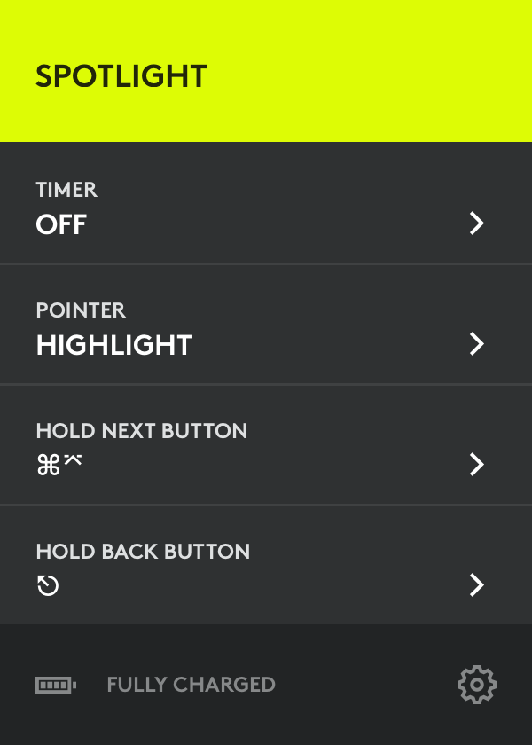

# Logitech Spotlight

There’s a brand new [Logitech Spotlight](http://www.logitech.com/en-us/product/spotlight-presentation-remote) presentation remote, which is already fully compatible with Shower: you can switch between slides, hover and click your presentation. But you can make the most of it by enabling two additional shortcuts in Logitech Presentation application, available for macOS and Windows.

1. [Download](http://support.logitech.com/en_us/software/logi-presentation) and install an app.
2. Go to the main menu and locate additional shortcuts options.
3. Change _Hold Next Button_ to `Cmd Enter` for macOS or `Shift F5` for Windows (just press it).
4. Change _Hold Back Button_ to `Esc` (just press it).

You might have to enable accessibility access on macOS in order to use this features. App will ask you once it’s needed.

Now when all is set you can:

- Start your presentation by holding next button: from the first slide (if none selected) or from the current slide (if there’s one).
- Exit full screen mode by holding back button. It might be useful when you need to find a certain slide and navigate the list.
