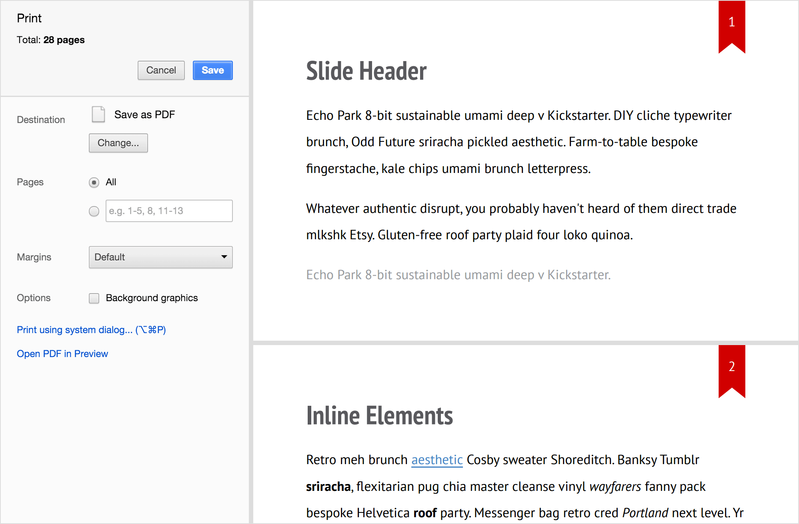

# Printing

You can export your presentation to PDF by sending it to print in list mode in Chrome and Opera desktop browsers.

1. Press `Cmd P` or `Ctrl P`
2. Select PDF in targets list
3. Save resulted file

## Other options

You could also try [Prince](http://princexml.com), [wkhtmltopdf](http://code.google.com/p/wkhtmltopdf) and such console utilities for printing, although not complete modern CSS features support and complicated configuration make them less convenient.
