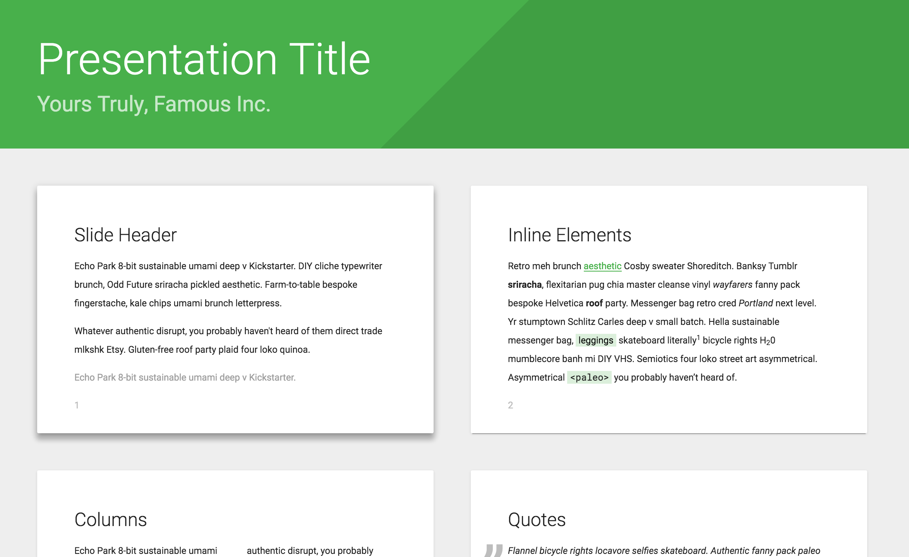

# Material theme for Shower

Default theme for the [Shower](https://github.com/shower/shower/) presentation engine. Doesn’t include engine itself. [See it in action](https://shwr.me/shower/themes/material/). Follow [@shower_me](https://twitter.com/shower_me) for support and updates, [file an issue](https://github.com/shower/shower/issues/new) if you have any.

## Usage

Get the Shower template where Ribbon is already included. Download the [template archive](https://shwr.me/shower.zip) or create a slide deck via [CLI tool](https://github.com/shower/cli). It requires [Node.js](https://nodejs.org/) installed.

	npx @shower/cli create

Wait for the installation and choose the **material** option in the wizard and you’re all set.

## Features

All theme’s features are demonstrated in the [index.html](index.html) file, [see it live](https://shwr.me/shower/themes/material/). Use it as a reference while building your presentation. See more detailed [features overview](https://github.com/shower/shower/blob/main/docs/features.md).

## Ratios

Material theme supports any slide ratio you want. But it’s optimized for the most common ones: 16×9 and 4×3. It’s 16×9 by default, but you can change it by adjusting `--slide-ratio` property for `.shower`, [see example](https://github.com/shower/ribbon/blob/main/index.html#L10) in `index.html`.

## Key color

By default Material theme is green, but you can easily change the key color by adjusting `--color-key` property for `.shower`. You can choose any color you want, just make sure that it’s dark enough for a good contrast. For example, in [Material Color Tool](https://material.io/tools/color/) good colors start at 500 column.

## PDF

You can export slides to PDF by printing it via built-in dialog in Chromium-based browsers or via CLI tool. See [printing documentation](https://github.com/shower/shower/blob/main/docs/pdf.md) for more options.

## Development

If you want to adjust theme for your needs:

1. Fork this repository and clone it to your local machine.
2. Install dependencies: `npm install`.
3. Start a local server with watcher: `npm start`.
4. Edit your files and see changes in the opened browser.

To take part in Material development please read [contributing guidelines](CONTRIBUTING.md) first and [file an issue](https://github.com/shower/shower/issues/new) before sending any pull request.

---
Licensed under [MIT License](LICENSE.md).
