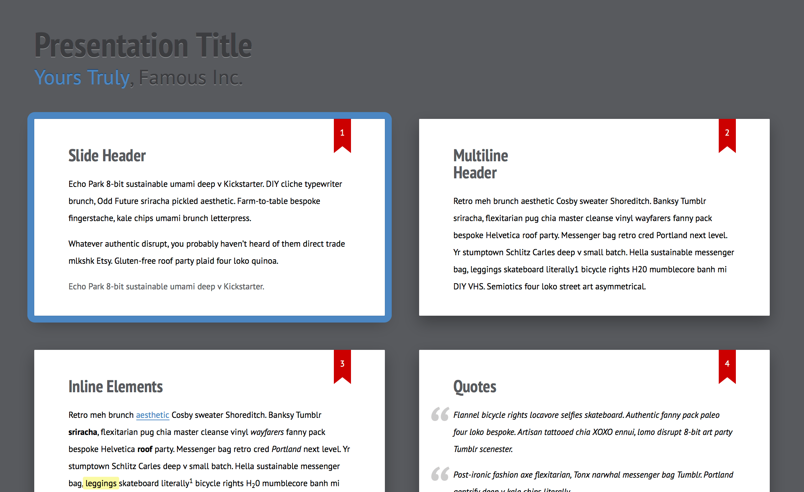

# Ribbon theme for Shower 

Default theme for the [Shower](https://github.com/shower/shower/) presentation engine. Doesn’t include engine itself. [See it in action](http://shwr.me/shower/themes/ribbon/). Follow [@shower_me](https://twitter.com/shower_me) for support and updates, [file an issue](https://github.com/shower/shower/issues/new) if you have any.

## Usage

Get the Shower template where Ribbon is already included. Download the [template archive](http://shwr.me/shower.zip) or install the package:

	npm install shower

If you want to install Ribbon separately you can install the package:

	npm install shower-ribbon

## Features

All theme’s features are demonstrated in the [index.html](index.html) file, [see it live](https://shwr.me/shower/themes/ribbon/). Use it as a reference while building your presentation. See more detailed [features overview](https://github.com/shower/shower/blob/master/docs/features.md).

## Ratios

Ribbon theme supports any slide ratio you want. But it’s optimized for the most common ones: 16×9 and 4×3. It’s 16×9 by default, but you can change it by adjusting `--slide-ratio` property for `.shower`, [see example](https://github.com/shower/ribbon/blob/master/index.html#L10) in `index.html`.

## PDF

Ribbon could be exported to PDF by printing it from the list mode in Chrome or Opera browsers. See [printing documentation](https://github.com/shower/shower/blob/master/docs/pdf.md) for more options.

## Development

If you want to adjust theme for your needs:

1. Fork this repository and clone it to your local machine.
2. Install dependencies: `npm install`.
3. Start a local server with watcher: `npm start`.
4. Edit your files and see changes in the opened browser.

To take part in Ribbon development please read [contributing guidelines](CONTRIBUTING.md) first and [file an issue](https://github.com/shower/shower/issues/new) before sending any pull request.

---
Licensed under [MIT License](LICENSE.md).
